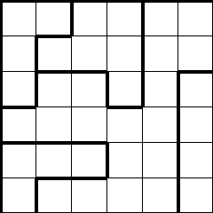
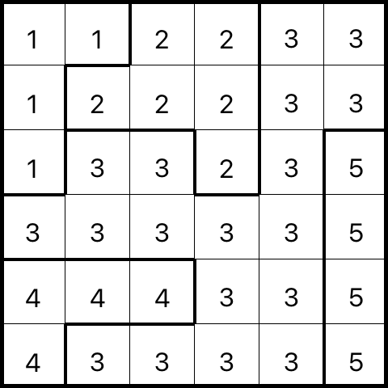

# NuruominoSolver

## Overview

**NuruominoSolver** is an AI-powered tool to solve and visualize Nuruomino (LITS) puzzles. Developed for an Artificial Intelligence course, it combines constraint satisfaction algorithms with a graphical visualizer for intuitive exploration of puzzle solutions.

---

## Problem Description

Nuruomino (LITS) is a logic puzzle played on a grid divided into regions. The objective is to fill each region with one tetromino (L, I, T, or S shape), following these rules:

- **Each region** must be filled with a tetromino.
- **No two identical tetrominoes** can be orthogonally adjacent.
- **All filled cells** must form a single connected area.
- **No 2×2 block** can be fully filled.

**Example Puzzle:**

| Input Grid | Solution Visualization |
|:----------:|:---------------------:|
|  |  |

---

## Solution Approach

- **Constraint Satisfaction:** The solver uses backtracking and constraint propagation to efficiently assign tetrominoes to regions, pruning invalid configurations early.
- **Connectivity Checks:** Ensures all filled cells are connected and no forbidden 2×2 blocks are formed.
- **Visualization:** The included visualizer displays both the puzzle and its solution for easy verification and presentation.

---